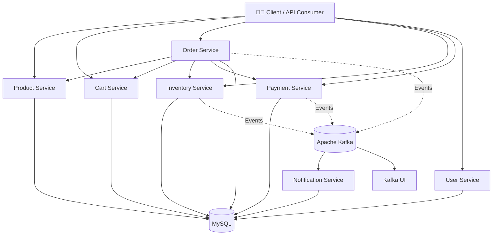

# 🛒 ShopSphere

<p align="center">
  <b>A Kubernetes-ready e-commerce microservices platform built with Spring Boot, Kafka, MySQL and Docker.</b>
</p>

---

## ✨ Overview

**ShopSphere** is a real-world style e-commerce application designed around a **microservices architecture**.

The project separates core business capabilities into independent services and demonstrates:

- 🧩 Microservices architecture
- ☕ Spring Boot services
- 🐳 Docker containerization
- ☸️ Kubernetes deployment
- 🗄️ MySQL persistence
- 📨 Apache Kafka event-driven communication
- 📊 Kafka UI for monitoring
- 🔐 Service configuration through Kubernetes ConfigMaps and Secrets
- 🔗 Internal Kubernetes service-to-service communication
- 🧪 Swagger/OpenAPI and Actuator endpoints for testing and observability

> **Project focus:** application architecture, containerization and Kubernetes deployment in a practical local development environment.

---

## 🏗️ Architecture



---

## 🧩 Services

| Service | Port | Responsibility |
|---|---:|---|
| 👤 User Service | `4001` | User-related operations |
| 📦 Product Service | `4002` | Products and categories |
| 🛒 Cart Service | `4003` | Shopping cart operations |
| 🧾 Order Service | `4004` | Order creation and lifecycle |
| 📊 Inventory Service | `4005` | Stock and inventory management |
| 💳 Payment Service | `4006` | Payment processing/simulation |
| 🔔 Notification Service | `4007` | Notification processing |
| 🗄️ MySQL | `3306` | Persistent data storage |
| 📨 Kafka | `29092` | Event/message communication |
| 📊 Kafka UI | `8080` | Kafka monitoring |

---

## 🔄 E-Commerce Flow

A typical order flow is designed around independent services:

```text
Customer
   │
   ▼
Product ───────► Cart
                  │
                  ▼
                Order
                  │
        ┌─────────┼─────────┐
        ▼         ▼         ▼
   Inventory    Payment   Kafka
                              │
                              ▼
                       Notification
```

This keeps responsibilities separated while allowing services to communicate through Kubernetes networking and Kafka events.

---

## ☸️ Kubernetes

The `k8s/` directory contains the Kubernetes manifests required to run ShopSphere.

```text
k8s/
├── namespace/
├── config/
├── secrets/
├── mysql/
├── kafka/
├── kafka-ui/
└── services/
```

The Kubernetes setup includes:

- Namespace isolation
- ConfigMap-based application configuration
- Kubernetes Secrets
- MySQL Deployment + PersistentVolumeClaim
- Kafka StatefulSet + PersistentVolumeClaim
- Kafka UI Deployment
- Individual Deployments and Services for ShopSphere microservices

### Kubernetes Documentation

👉 **[Read the Kubernetes deployment guide](k8s/README.md)**

It contains the practical deployment sequence, useful commands, health checks, port-forwarding instructions and troubleshooting notes.

---

## 💻 Application Source

The application source code is maintained separately under:

```text
shopsphere/
├── user-service/
├── product-service/
├── cart-service/
├── order-service/
├── inventory-service/
├── payment-service/
├── notification-service/
├── docker-compose.yml
└── README.md
```

### Source Code Documentation

👉 **[Open the ShopSphere application README](shopsphere/README.md)**

Each service also contains its own documentation where applicable.

---

## 🐳 Running the Application

The project supports two complementary approaches:

### Docker Compose

Useful for quickly running the application stack in a containerized environment.

See:

👉 **[shopsphere/README.md](shopsphere/README.md)**

### Kubernetes

The Kubernetes setup is the main infrastructure demonstration of this repository.

See:

👉 **[k8s/README.md](k8s/README.md)**

---

## 📊 Kafka Monitoring

Kafka UI provides a convenient dashboard for inspecting the Kafka cluster, brokers, topics and partitions.

<p align="center">
  
</p>

---

## 🧪 API Testing

The services expose:

- REST APIs
- Swagger/OpenAPI documentation
- Spring Boot Actuator health endpoints

For example:

```text
http://localhost:4002/swagger-ui/index.html
http://localhost:4004/swagger-ui/index.html

http://localhost:4002/actuator/health
http://localhost:4004/actuator/health
```

The exact testing and port-forwarding commands are documented in:

👉 **[k8s/README.md](k8s/README.md)**

---

## 🛠️ Technology Stack

| Area | Technology |
|---|---|
| Backend | Java / Spring Boot |
| APIs | REST / OpenAPI |
| Messaging | Apache Kafka |
| Database | MySQL |
| Containers | Docker |
| Orchestration | Kubernetes |
| Local Kubernetes | Kind |
| Monitoring | Kafka UI / Spring Boot Actuator |
| API Documentation | Swagger / OpenAPI |
| Configuration | Kubernetes ConfigMap + Secret |

---

## 📁 Repository Structure

```text
microservice-kafka-k8s/
│
├── images/
│   ├── kafka-ui-dashboard.png
│   ├── kubernetes-deployments.png
│   └── order-service-swagger.png
│
├── shopsphere/
│   ├── user-service/
│   ├── product-service/
│   ├── cart-service/
│   ├── order-service/
│   ├── inventory-service/
│   ├── payment-service/
│   ├── notification-service/
│   ├── docker-compose.yml
│   └── README.md
│
├── k8s/
│   ├── namespace/
│   ├── config/
│   ├── secrets/
│   ├── mysql/
│   ├── kafka/
│   ├── kafka-ui/
│   ├── services/
│   └── README.md
│
└── README.md
```

---

## 🎯 What This Project Demonstrates

This project is intended to demonstrate practical experience with:

**Microservices → Containers → Kubernetes → Persistent Storage → Messaging → API Testing**

Rather than keeping the entire application inside one deployment, the major business capabilities are independently deployable and communicate through well-defined service boundaries.

---

## 📚 Documentation

| Documentation | Link |
|---|---|
| 🏠 Project Overview | `README.md` |
| ☸️ Kubernetes Setup | [`k8s/README.md`](k8s/README.md) |
| 💻 Application / Source | [`shopsphere/README.md`](shopsphere/README.md) |

---

## 👨‍💻 Project

**ShopSphere — E-Commerce Microservices**

Built as a practical demonstration of modern backend, messaging, containerization and Kubernetes concepts.

> ⭐ If you find the project useful, feel free to star the repository.
