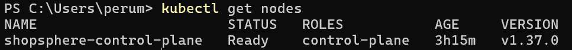
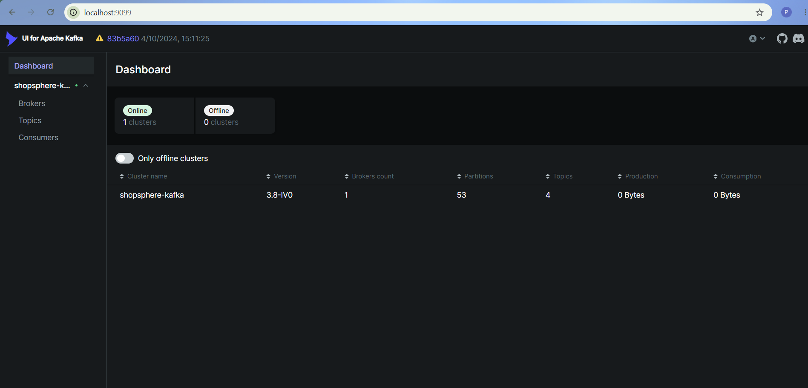
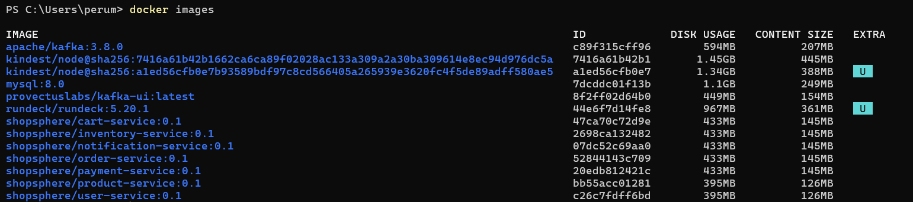
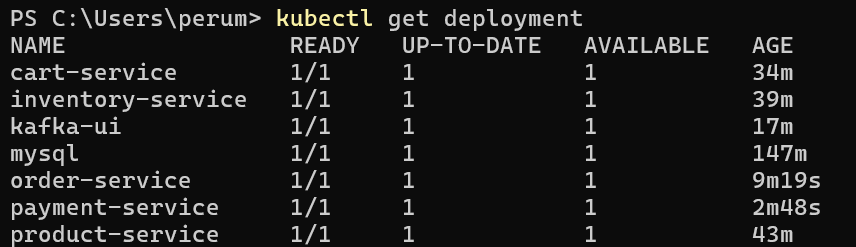
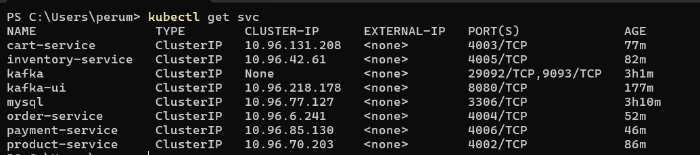
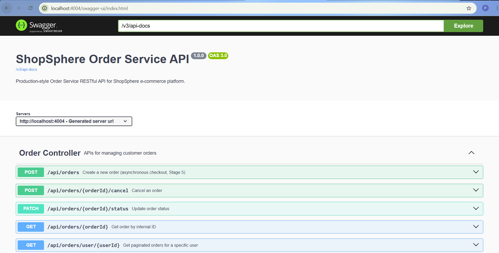

# ☸️ ShopSphere — Kubernetes

This folder contains the Kubernetes manifests used to run the **ShopSphere** microservices application on a local **Kind Kubernetes cluster**.

The setup includes:

- ☸️ Kind Kubernetes cluster
- 🗄️ MySQL with persistent storage
- 📨 Apache Kafka
- 📊 Kafka UI
- 🔧 Kubernetes ConfigMap and Secret
- 🚀 ShopSphere microservice Deployments and Services
- 🩺 Actuator health checks
- 📖 Swagger / OpenAPI documentation

---

## 📁 Kubernetes Folder Structure

```text
k8s/
├── clusters.yaml
│
├── namespace/
│   └── namespace.yaml
│
├── config/
│   └── configmap.yaml
│
├── secrets/
│   └── mysql-secret.yaml
│
├── mysql/
│   ├── pvc.yaml
│   ├── deployment.yaml
│   └── service.yaml
│
├── kafka/
│   ├── pvc.yaml
│   ├── statefulset.yaml
│   └── service.yaml
│
├── kafka-ui/
│   ├── deployment.yaml
│   └── service.yaml
│
└── services/
    ├── user-service.yaml
    ├── product-service.yaml
    ├── cart-service.yaml
    ├── inventory-service.yaml
    ├── payment-service.yaml
    ├── notification-service.yaml
    └── order-service.yaml
```

---

## 🛠️ Prerequisites

Make sure the following are installed and available in PowerShell:

```powershell
docker --version
kind version
kubectl version --client
```

---

# 1. ☸️ Create the Kind Cluster

The cluster configuration is stored in:

```text
k8s/clusters.yaml
```

Current configuration:

```yaml
kind: Cluster
apiVersion: kind.x-k8s.io/v1alpha4
nodes:
  - role: control-plane
    extraPortMappings:
      - containerPort: 30080
        hostPort: 30080
  - role: worker
  - role: worker
```

Create the cluster from the repository root:

```powershell
kind create cluster --name shopsphere --config .\k8s\clusters.yaml
```

Verify the cluster:

```powershell
kind get clusters
kubectl get nodes -o wide
```

Example:



---

# 2. 📦 Create the Namespace

Create the ShopSphere namespace:

```powershell
kubectl create namespace shopsphere
```

Set it as the current namespace:

```powershell
kubectl config set-context --current --namespace=shopsphere
```

Verify:

```powershell
kubectl get namespace
kubectl get all -n shopsphere
```

> The Kubernetes manifests in this project use the `shopsphere` namespace.

---

# 3. ⚙️ Apply Configuration

Apply the ConfigMap:

```powershell
kubectl apply -f .\k8s\config\configmap.yaml -n shopsphere
```

Apply the MySQL Secret:

```powershell
kubectl apply -f .\k8s\secrets\mysql-secret.yaml -n shopsphere
```

Check:

```powershell
kubectl get configmap -n shopsphere
kubectl get secrets -n shopsphere
```

> Do not commit real production credentials to GitHub. Keep credentials suitable for local development only.

---

# 4. 🗄️ Deploy MySQL

Apply the persistent volume claim:

```powershell
kubectl apply -f .\k8s\mysql\pvc.yaml -n shopsphere
```

Deploy MySQL:

```powershell
kubectl apply -f .\k8s\mysql\deployment.yaml -n shopsphere
```

Create the MySQL Service:

```powershell
kubectl apply -f .\k8s\mysql\service.yaml -n shopsphere
```

Check the deployment:

```powershell
kubectl get pods -n shopsphere
kubectl get pvc -n shopsphere
kubectl get svc -n shopsphere
```

MySQL is available to the application inside Kubernetes through:

```text
mysql:3306
```

---

# 5. 📨 Deploy Apache Kafka

Apply Kafka persistent storage:

```powershell
kubectl apply -f .\k8s\kafka\pvc.yaml -n shopsphere
```

Deploy Kafka:

```powershell
kubectl apply -f .\k8s\kafka\statefulset.yaml -n shopsphere
```

Create the Kafka Service:

```powershell
kubectl apply -f .\k8s\kafka\service.yaml -n shopsphere
```

Check:

```powershell
kubectl get pods -n shopsphere
kubectl get statefulsets -n shopsphere
kubectl get pvc -n shopsphere
kubectl get svc -n shopsphere
```

The application services use Kafka through:

```text
kafka:29092
```

### Kafka



---

# 6. 📊 Deploy Kafka UI

Deploy Kafka UI:

```powershell
kubectl apply -f .\k8s\kafka-ui\deployment.yaml -n shopsphere
```

Create its Service:

```powershell
kubectl apply -f .\k8s\kafka-ui\service.yaml -n shopsphere
```

Check:

```powershell
kubectl get pods -n shopsphere
kubectl get svc -n shopsphere
```

Port-forward Kafka UI:

```powershell
kubectl port-forward svc/kafka-ui 9099:8080 -n shopsphere
```

Open:

```text
http://localhost:9099
```

### Kafka UI


---

# 7. 🐳 Build the ShopSphere Docker Images

Move into the ShopSphere source directory:

```powershell
cd .\shopsphere
```

Build the service images:

```powershell
docker build -t shopsphere/user-service:0.1 .\user-service
docker build -t shopsphere/product-service:0.1 .\product-service
docker build -t shopsphere/cart-service:0.1 .\cart-service
docker build -t shopsphere/inventory-service:0.1 .\inventory-service
docker build -t shopsphere/payment-service:0.1 .\payment-service
docker build -t shopsphere/notification-service:0.1 .\notification-service
docker build -t shopsphere/order-service:0.1 .\order-service
```

Verify the images:

```powershell
docker images | findstr shopsphere
```

### Docker Images



---

# 8. 📥 Load Images into Kind

Because the service images are built locally, load them into the Kind cluster:

```powershell
kind load docker-image shopsphere/cart-service:0.1 --name shopsphere
kind load docker-image shopsphere/inventory-service:0.1 --name shopsphere
kind load docker-image shopsphere/notification-service:0.1 --name shopsphere
kind load docker-image shopsphere/order-service:0.1 --name shopsphere
kind load docker-image shopsphere/payment-service:0.1 --name shopsphere
kind load docker-image shopsphere/product-service:0.1 --name shopsphere
kind load docker-image shopsphere/user-service:0.1 --name shopsphere
```

This makes the locally built images available to the Kubernetes workloads running inside Kind.

---

# 9. 🚀 Deploy the ShopSphere Services

The service manifests are located under:

```text
k8s/services/
```

Deploy each service:

### User Service

```powershell
kubectl apply -f .\k8s\services\user-service.yaml
```

### Product Service

```powershell
kubectl apply -f .\k8s\services\product-service.yaml
```

### Cart Service

```powershell
kubectl apply -f .\k8s\services\cart-service.yaml
```

### Inventory Service

```powershell
kubectl apply -f .\k8s\services\inventory-service.yaml
```

### Payment Service

```powershell
kubectl apply -f .\k8s\services\payment-service.yaml
```

### Notification Service

```powershell
kubectl apply -f .\k8s\services\notification-service.yaml
```

### Order Service

```powershell
kubectl apply -f .\k8s\services\order-service.yaml
```

Check all workloads:

```powershell
kubectl get deployments -n shopsphere
kubectl get pods -n shopsphere
kubectl get services -n shopsphere
```

A useful overview:



---

# 🔗 10. Kubernetes Services

ShopSphere services communicate using Kubernetes Service names instead of `localhost`.

| Service | Port |
|---|---:|
| User Service | `4001` |
| Product Service | `4002` |
| Cart Service | `4003` |
| Order Service | `4004` |
| Inventory Service | `4005` |
| Payment Service | `4006` |
| Notification Service | `4007` |
| MySQL | `3306` |
| Kafka | `29092` |
| Kafka UI | `8080` |

For example:

```text
http://product-service:4002
http://cart-service:4003
http://inventory-service:4005
http://payment-service:4006
```

View the Kubernetes Services:

```powershell
kubectl get svc -n shopsphere
```



---

# 🩺 11. Health Checks

Each Spring Boot service exposes an Actuator health endpoint.

Port-forward the required service:

```powershell
kubectl port-forward svc/user-service 4001:4001 -n shopsphere
```

Then check:

```text
http://localhost:4001/actuator/health
```

The same pattern applies to the other services:

```text
http://localhost:4002/actuator/health
http://localhost:4003/actuator/health
http://localhost:4004/actuator/health
http://localhost:4005/actuator/health
http://localhost:4006/actuator/health
http://localhost:4007/actuator/health
```

---

# 📖 12. Swagger / OpenAPI

Each service provides Swagger UI.

### User Service

```powershell
kubectl port-forward svc/user-service 4001:4001 -n shopsphere
```

```text
http://localhost:4001/swagger-ui/index.html
```

### Product Service

```powershell
kubectl port-forward svc/product-service 4002:4002 -n shopsphere
```

```text
http://localhost:4002/swagger-ui/index.html
```

### Cart Service

```powershell
kubectl port-forward svc/cart-service 4003:4003 -n shopsphere
```

```text
http://localhost:4003/swagger-ui/index.html
```

### Order Service

```powershell
kubectl port-forward svc/order-service 4004:4004 -n shopsphere
```

```text
http://localhost:4004/swagger-ui/index.html
```

### Inventory Service

```powershell
kubectl port-forward svc/inventory-service 4005:4005 -n shopsphere
```

```text
http://localhost:4005/swagger-ui/index.html
```

### Payment Service

```powershell
kubectl port-forward svc/payment-service 4006:4006 -n shopsphere
```

```text
http://localhost:4006/swagger-ui/index.html
```

### Notification Service

```powershell
kubectl port-forward svc/notification-service 4007:4007 -n shopsphere
```

```text
http://localhost:4007/swagger-ui/index.html
```

### Swagger Example



---

# 🔍 13. Useful Kubernetes Commands

### View Pods

```powershell
kubectl get pods -n shopsphere
```

### View Deployments

```powershell
kubectl get deployments -n shopsphere
```

### View Services

```powershell
kubectl get svc -n shopsphere
```

### View Persistent Volumes

```powershell
kubectl get pvc -n shopsphere
```

### View Kafka StatefulSet

```powershell
kubectl get statefulset -n shopsphere
```

### View Pod Logs

```powershell
kubectl logs <pod-name> -n shopsphere
```

### Follow Pod Logs

```powershell
kubectl logs -f <pod-name> -n shopsphere
```

### Describe a Pod

```powershell
kubectl describe pod <pod-name> -n shopsphere
```

### View Recent Events

```powershell
kubectl get events -n shopsphere --sort-by=.lastTimestamp
```

---

# 🩹 14. Troubleshooting

If a Pod is not starting:

```powershell
kubectl get pods -n shopsphere
```

Then inspect it:

```powershell
kubectl describe pod <pod-name> -n shopsphere
```

Check its logs:

```powershell
kubectl logs <pod-name> -n shopsphere
```

If the container restarted, check the previous container logs:

```powershell
kubectl logs <pod-name> --previous -n shopsphere
```

For a complete view:

```powershell
kubectl get all -n shopsphere
kubectl get pvc -n shopsphere
kubectl get events -n shopsphere --sort-by=.lastTimestamp
```

---

# 🗄️ 15. Persistent Storage

The stateful components use Kubernetes PersistentVolumeClaims.

```text
MySQL
└── mysql-pvc

Kafka
└── kafka-pvc
```

Check them with:

```powershell
kubectl get pvc -n shopsphere
```

---

# 🧹 16. Remove the Environment

To remove the ShopSphere namespace:

```powershell
kubectl delete namespace shopsphere
```

To remove the complete Kind cluster:

```powershell
kind delete cluster --name shopsphere
```

---

# 🔗 Related Documentation

This README focuses specifically on the Kubernetes deployment.

For the application and microservice documentation:

👉 [`../shopsphere/README.md`](../shopsphere/README.md)

For the overall project:

👉 [`../README.md`](../README.md)
