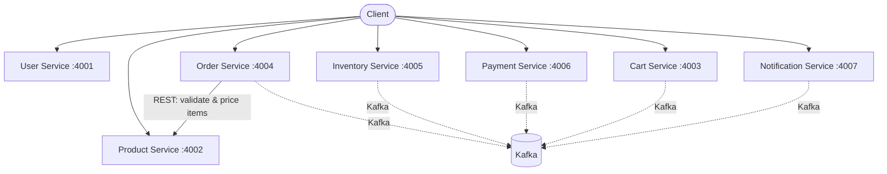
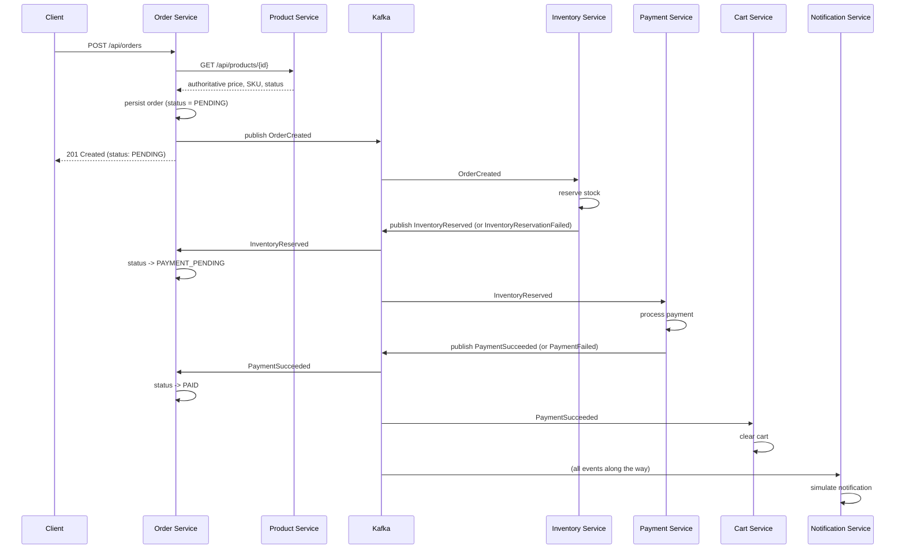
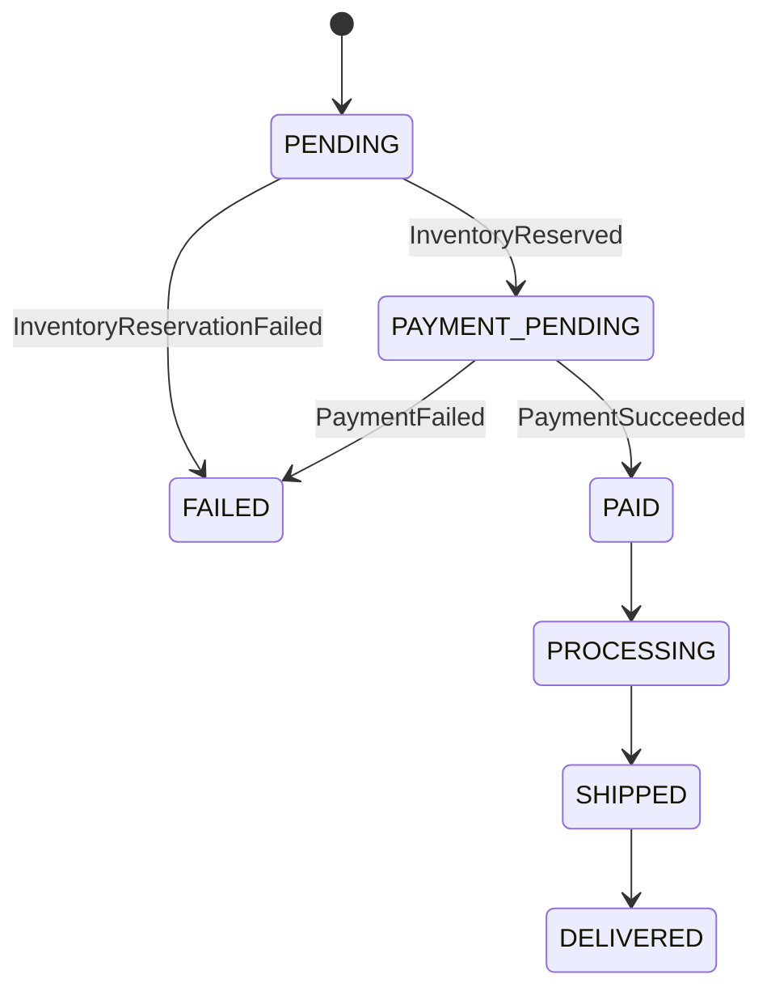
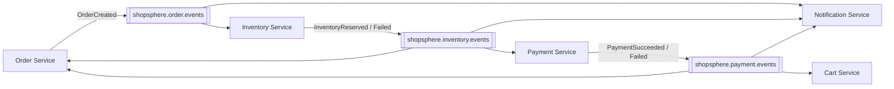

# ShopSphere

ShopSphere is a small e-commerce backend built as **seven independent Spring
Boot microservices**, each owning its own MySQL database. Checkout is
synchronous where it needs to be (product validation and pricing) and
event-driven where it benefits from decoupling (inventory reservation,
payment processing, cart clearing, and notifications) — all connected
through **Apache Kafka**.

This README gives you the full picture in a few minutes. For anything
service-specific, follow the links in the [Services](#services) table.

---

## Project Overview

### What the system does

ShopSphere lets a client:
- Manage users and their addresses
- Browse products and categories
- Build a shopping cart
- Check out, which creates an order, reserves stock, and takes payment
- Track an order's status as it moves through fulfillment
- Look up inventory, payments, and notification history

### What the services are responsible for

| Service | Responsible for |
|---|---|
| **User Service** | User accounts and their saved addresses |
| **Product Service** | Product catalog and categories — the source of truth for price, SKU, and availability status |
| **Cart Service** | A user's in-progress shopping cart |
| **Order Service** | Creating orders, orchestrating checkout, and tracking order status |
| **Inventory Service** | Stock levels and reservations against orders |
| **Payment Service** | Processing and recording payments |
| **Notification Service** | Simulated order/payment notifications (no real email/SMS is sent) |

### High-level architecture

Checkout starts with one synchronous call (Order Service needs Product
Service's real, current price before it can create an order — never
trusting a price supplied by the client) and then continues entirely
through Kafka:



Solid arrows are synchronous REST calls; dashed arrows are Kafka
publish/consume relationships (detailed in the next section). Every other
service-to-service interaction you might expect (e.g. Order Service calling
Inventory or Payment directly) **does not exist** — those two services find
out about a new order by consuming Kafka events, not by being called.

---

## Architecture

### Who talks to whom, and how

| From | To | How | Why |
|---|---|---|---|
| Order Service | Product Service | REST (`GET /api/products/{id}`) | Resolve the authoritative price/SKU/name for every item before creating an order — the client's request only ever supplies `productId` + `quantity` |
| Order Service | Kafka | Publish `OrderCreated` | Announce that an order was persisted, without waiting for inventory/payment |
| Inventory Service | Kafka | Consume `OrderCreated`; publish `InventoryReserved` / `InventoryReservationFailed` | Reserve stock for the order asynchronously |
| Payment Service | Kafka | Consume `InventoryReserved`; publish `PaymentSucceeded` / `PaymentFailed` | Only attempt payment once stock is actually reserved |
| Order Service | Kafka | Consume all four downstream events | Advance the order's status as the outcome of each step becomes known |
| Cart Service | Kafka | Consume `PaymentSucceeded` | Clear the cart once an order is actually paid for |
| Notification Service | Kafka | Consume `OrderCreated`, `InventoryReservationFailed`, `PaymentSucceeded`, `PaymentFailed` | Simulate a notification for each meaningful outcome |

**Nothing calls Cart Service, Payment Service, or Inventory Service over
REST as part of checkout.** Those REST endpoints still exist (useful for
direct lookups, admin actions, and testing), but the checkout *workflow*
itself is Kafka-driven from the moment `OrderCreated` is published.

### The checkout flow, end to end



The client only ever sees the first `201 Created` response, with the order
still `PENDING`. Everything below that line happens after the response has
already been sent — the client (or you, testing it) finds out the outcome
by polling `GET /api/orders/{id}` and watching `status` change.

### Order status flow



(`CANCELLED` is also reachable from most non-final states via
`POST /api/orders/{id}/cancel` — omitted above for clarity.)

---

## Kafka Architecture

### Why Kafka

Reserving stock and charging a payment don't need to block the client's
checkout request, and Order Service shouldn't need to know *how* Inventory
or Payment do their jobs — it only needs to know the outcome. Kafka
decouples "an order was created" from "what happens as a result," so each
service can react independently, at its own pace, without Order Service
calling it directly.

### Broker

A single Kafka broker running in **KRaft mode** (no separate ZooKeeper
process) — see `docker-compose.yml`. This is a development setup, not a
multi-broker production cluster.

### Topics

| Topic | Published by | Carries |
|---|---|---|
| `shopsphere.order.events` | Order Service | `OrderCreated` |
| `shopsphere.inventory.events` | Inventory Service | `InventoryReserved`, `InventoryReservationFailed` |
| `shopsphere.payment.events` | Payment Service | `PaymentSucceeded`, `PaymentFailed` |

One topic per producing service — a message's `eventType` field (inside the
JSON payload) tells a consumer which of that topic's event kinds it's
looking at, rather than the topic name alone.

Every message is **keyed by `orderId`** (as a string), so all events for
the same order are delivered in order relative to each other. Events for
different orders have no ordering guarantee relative to one another
(Kafka only guarantees ordering within a partition).

### Producers and consumers



| Consumer group | Service | Subscribed to | Reacts to |
|---|---|---|---|
| `shopsphere-inventory-service` | Inventory Service | `shopsphere.order.events` | `OrderCreated` → attempts to reserve stock |
| `shopsphere-payment-service` | Payment Service | `shopsphere.inventory.events` | `InventoryReserved` only → processes payment |
| `shopsphere-order-service` | Order Service | `shopsphere.inventory.events`, `shopsphere.payment.events` | all four → advances order status |
| `shopsphere-cart-service` | Cart Service | `shopsphere.payment.events` | `PaymentSucceeded` only → clears the cart |
| `shopsphere-notification-service` | Notification Service | all three topics | `OrderCreated`, `InventoryReservationFailed`, `PaymentSucceeded`, `PaymentFailed` → simulates a notification |

Every service uses its **own** consumer group name — never shared across
services — so each one gets a full, independent copy of every message it's
interested in.

### Event shape

Every event carries the same metadata envelope plus its own domain fields —
never a raw copy of a JPA entity, and never a REST request DTO reused as an
event:

```json
{
  "eventId": "…",          // unique per message
  "eventType": "OrderCreated",
  "eventVersion": 1,
  "occurredAt": "2026-…",
  "correlationId": "…",     // same value across an entire request's event chain
  "orderId": 6,
  "orderNumber": "ORD-…",
  "...": "..."
}
```

### Known limitations

- **Dual-write problem**: saving to a service's own database and publishing
  the corresponding Kafka event are two separate steps, not one atomic
  operation. A crash between them means the database moved forward but no
  downstream service ever finds out.
- **At-least-once delivery**: a consumer may see the same message more than
  once. Inventory Service and Payment Service each have a narrow,
  purpose-built check ("has this order already been reserved/paid for?")
  to avoid double-reserving stock or double-charging — this is not a
  general idempotency framework.
- **No retry topics or dead-letter queue**: a consumer that fails to
  process a message logs the error and moves on.
- **No cross-service compensation (Saga)**: if payment fails after
  inventory was reserved, the order is marked `FAILED`, but nothing
  automatically tells Inventory Service (over Kafka) to release that
  specific reservation.

---

## Databases

Every service owns its database exclusively — no service reads or writes
another service's tables.

| Service | Database | Technology |
|---|---|---|
| User Service | `shopsphere_user` | MySQL 8 |
| Product Service | `shopsphere_product` | MySQL 8 |
| Cart Service | `shopsphere_cart` | MySQL 8 |
| Order Service | `shopsphere_order` | MySQL 8 |
| Inventory Service | `shopsphere_inventory` | MySQL 8 |
| Payment Service | `shopsphere_payment` | MySQL 8 |
| Notification Service | `shopsphere_notification` | MySQL 8 |

All seven databases can live on the same MySQL server instance (that's how
`docker-compose.yml` runs them) — MySQL databases are just namespaces, and
each service only ever connects to its own. Every service manages its own
schema with **Flyway** migrations, applied automatically on startup — there
is no manual schema setup step. See each service's own README for its
table list.

---

## Services

| Service | Responsibility | Port | Database | Swagger UI |
|---|---|---|---|---|
| [User Service](./user-service/README.md) | Users & addresses | 4001 | `shopsphere_user` | http://localhost:4001/swagger-ui.html |
| [Product Service](./product-service/README.md) | Products & categories | 4002 | `shopsphere_product` | http://localhost:4002/swagger-ui.html |
| [Cart Service](./cart-service/README.md) | Shopping carts | 4003 | `shopsphere_cart` | http://localhost:4003/swagger-ui.html |
| [Order Service](./order-service/README.md) | Order creation & checkout orchestration | 4004 | `shopsphere_order` | http://localhost:4004/swagger-ui.html |
| [Inventory Service](./inventory-service/README.md) | Stock & reservations | 4005 | `shopsphere_inventory` | http://localhost:4005/swagger-ui.html |
| [Payment Service](./payment-service/README.md) | Payment processing | 4006 | `shopsphere_payment` | http://localhost:4006/swagger-ui.html |
| [Notification Service](./notification-service/README.md) | Simulated notifications | 4007 | `shopsphere_notification` | http://localhost:4007/swagger-ui.html |

Every service also exposes a health check at
`http://localhost:{port}/actuator/health`.

---

## Running the Project

### Requirements

- Docker and Docker Compose (the `docker compose` CLI, not the legacy
  `docker-compose` v1 tool)

Nothing else needs to be installed locally — Maven and the JDK only run
*inside* the build, via each service's `Dockerfile`.

### 1. Configure environment variables

```bash
cp .env.example .env
```
Open `.env` and set `MYSQL_ROOT_PASSWORD` to whatever you'd like your local
MySQL root password to be. This is the only required configuration.

### 2. Build and start everything

```bash
docker compose build --progress=plain
docker compose up -d 
```

This starts, in dependency order: MySQL → Kafka → all seven services. Each
service's own database (`shopsphere_user`, `shopsphere_product`, etc.) is
created automatically on first connection — no manual `CREATE DATABASE`
step, and no seed-data step is required to start the system (though you'll
need to create at least one product and give it stock before you can test
a full checkout — see the individual service READMEs).

Check everything came up healthy:
```bash
docker compose ps
```

### 3. Stop everything

```bash
docker compose down
```

To also wipe all data (MySQL data and Kafka topics) and start completely
fresh next time:
```bash
docker compose down -v
```

### Optional: Kafka UI

`docker-compose.yml` also starts a lightweight Kafka UI at
**http://localhost:9099** — useful for inspecting topics, reading
individual event payloads, and checking consumer group lag while you're
learning the system. It's not required for the application to function.

### Running a single service outside Docker (for active development)

Each service is a completely independent Maven project (there's no shared
parent module), so you can run any one of them directly with Maven while
the rest of the stack stays in Docker — e.g. to iterate quickly on Order
Service:
```bash
cd order-service
mvn spring-boot:run
```
Its `application.properties` defaults already point at `localhost` for
MySQL and Kafka, so as long as `docker compose up -d mysql kafka` (and the
other six services you depend on) are running, this works without any
extra configuration. See each service's own README for what it needs.

---

## Service Documentation

- [User Service](./user-service/README.md)
- [Product Service](./product-service/README.md)
- [Cart Service](./cart-service/README.md)
- [Order Service](./order-service/README.md)
- [Inventory Service](./inventory-service/README.md)
- [Payment Service](./payment-service/README.md)
- [Notification Service](./notification-service/README.md)

For a deeper narrative walkthrough (Kafka concepts from scratch, a Kafka UI
tutorial, and a full worked example), see
[`docs/`](./docs/STAGE4_5_ARCHITECTURE.md) and the onboarding guide
included in this project.
