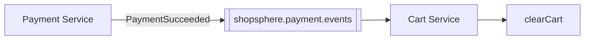

# Cart Service

Owns each user's shopping cart. Carts are cleared automatically once an
order is successfully paid for — via Kafka, not because any other service
calls this one directly.

⬅ [Back to root README](../README.md)

---

## Service Overview

**Responsible for:** a user's in-progress cart and its line items — add,
update quantity, remove, view, and clear.

**Role in the architecture:** Cart Service is a leaf consumer in the Kafka
flow. It doesn't participate in checkout itself (the client submits order
items directly to Order Service — the cart is just where the customer built
up that list beforehand) but it listens for `PaymentSucceeded` so it can
clear the cart the moment an order is actually paid for, without Order
Service needing to call it.

---

## Architecture

```
Controller (CartController)
      │
      ▼
Service (CartService, CartItemService)
      │
      ▼
Repository (Spring Data JPA)
      │
      ▼
MySQL (shopsphere_cart)

Kafka Listener (PaymentEventCartConsumer)
      │
      ▼
Service (CartService.clearCart) ── same service layer as above, no separate code path
```

The Kafka listener is intentionally thin — it deserializes the event and
delegates straight to `CartService.clearCart()`, the exact same method a
REST caller would invoke.

---

## Database

- **Technology:** MySQL 8, schema managed by **Flyway**, applied automatically on startup.
- **Database name:** `shopsphere_cart`

| Table | Purpose | Key columns |
|---|---|---|
| `carts` | One active cart per user (plus history) | `user_id`, `status` (`ACTIVE`/`CHECKED_OUT`/`ABANDONED`) |
| `cart_items` | Line items in a cart | `cart_id` (FK), `product_id`, `quantity`, `unit_price` |

---

## APIs

- **Base URL:** `http://localhost:4003`
- **Swagger UI:** http://localhost:4003/swagger-ui.html
- **Health check:** http://localhost:4003/actuator/health
- **Authentication:** none — every request must include an `X-User-Id`
  header identifying whose cart to act on (there's no token to derive this
  from).

| Method | Path | Purpose |
|---|---|---|
| GET | `/api/cart` | Get (or auto-create) the caller's active cart |
| POST | `/api/cart/items` | Add an item |
| PUT | `/api/cart/items/{itemId}` | Update an item's quantity |
| DELETE | `/api/cart/items/{itemId}` | Remove an item |
| DELETE | `/api/cart` | Clear the whole cart |

---

## Kafka

**Consumes from:** `shopsphere.payment.events`, consumer group `shopsphere-cart-service`

| Event | Action |
|---|---|
| `PaymentSucceeded` | Calls `CartService.clearCart(userId)` |
| `PaymentFailed` | Ignored — a failed payment must not clear the cart, so the customer can retry checkout |



Cart Service **produces no events of its own** in this stage.

No explicit duplicate-delivery guard was needed here: `clearCart()` only
acts on a cart that is still `ACTIVE` and is a no-op otherwise, so a
redelivered `PaymentSucceeded` message (Kafka's at-least-once delivery — see
root README) simply does nothing the second time.

---

## Communication With Other Services

| Direction | Service | Mechanism | What flows |
|---|---|---|---|
| Inbound | Payment Service | Kafka (`shopsphere.payment.events`) | `PaymentSucceeded` triggers a cart clear |
| Outbound | — | — | Cart Service makes no REST calls to any other service |

---

## Configuration

| Property | Default | Notes |
|---|---|---|
| `server.port` | `4003` | |
| `spring.datasource.url` | `jdbc:mysql://localhost:3306/shopsphere_cart?...` | `mysql:3306` when run via Docker Compose |
| `spring.datasource.password` | *(local dev placeholder)* | See `.env.example` at the project root |
| `spring.kafka.bootstrap-servers` | `localhost:9092` | Overridable via `KAFKA_BOOTSTRAP_SERVERS`; `kafka:29092` when run via Docker Compose |
| `spring.kafka.consumer.group-id` | `shopsphere-cart-service` | |

---

## Running the Service

Standalone (needs MySQL and Kafka reachable):
```bash
cd cart-service
mvn spring-boot:run
```

Or as part of the full stack:
```bash
docker compose up -d --build cart-service
```

Run its tests:
```bash
mvn clean test
```
