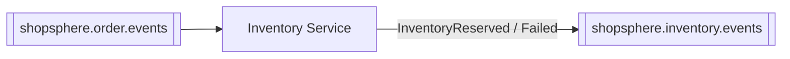

# Inventory Service

Owns stock levels and reservations. Reserves stock automatically in
response to a new order — Order Service never calls this service directly
during checkout.

⬅ [Back to root README](../README.md)

---

## Service Overview

**Responsible for:** tracking available/reserved stock per product, and
recording reservations against orders.

**Role in the architecture:** Inventory Service is the first service that
reacts to a new order. It consumes `OrderCreated`, attempts to reserve
stock for every item, and publishes the outcome — it never needs to be
called synchronously by Order Service.

---

## Architecture

```
Controller (InventoryController)         Kafka Listener (InventoryEventConsumer)
      │                                          │
      ▼                                          ▼
Service (ReservationService / InventoryService) ◄┘  (same service layer either way)
      │
      ▼
Repository (Spring Data JPA)
      │
      ▼
MySQL (shopsphere_inventory)
      │
      ▼ (on outcome)
Event Producer (InventoryEventProducer) ──► Kafka
```

The Kafka listener never calls this service's own REST endpoint — it
invokes `ReservationService` directly, exactly the same business logic the
REST `/reserve` endpoint uses.

---

## Database

- **Technology:** MySQL 8, schema managed by **Flyway**, applied automatically on startup.
- **Database name:** `shopsphere_inventory`

| Table | Purpose | Key columns |
|---|---|---|
| `inventory` | Stock per product | `product_id`, `sku`, `available_quantity`, `reserved_quantity`, `reorder_level` |
| `inventory_reservations` | One row per reservation | `inventory_id` (FK), `order_id`, `quantity`, `status` (`RESERVED`/`RELEASED`/`CONFIRMED`/`CANCELLED`) |

---

## APIs

- **Base URL:** `http://localhost:4005`
- **Swagger UI:** http://localhost:4005/swagger-ui.html
- **Health check:** http://localhost:4005/actuator/health
- **Authentication:** none.

| Method | Path | Purpose |
|---|---|---|
| POST | `/api/inventory` | Initialize inventory for a product |
| GET | `/api/inventory/{productId}` | Get stock levels |
| PUT | `/api/inventory/{productId}` | Adjust stock/reorder level |
| GET | `/api/inventory/{productId}/availability` | Quick available/salable check |
| POST | `/api/inventory/{productId}/reserve` | Reserve stock (also invoked internally by the Kafka consumer) |
| POST | `/api/inventory/reservations/{reservationId}/release` | Release a reservation |
| POST | `/api/inventory/reservations/{reservationId}/confirm` | Confirm a reservation |
| GET | `/api/inventory/reservations/order/{orderId}` | List reservations for an order |

There is no "list all inventory" endpoint — always look up by product ID.

---

## Kafka

**Consumes from:** `shopsphere.order.events`, consumer group `shopsphere-inventory-service`

| Event | Action |
|---|---|
| `OrderCreated` | Attempts to reserve stock for every item in the order |

**Produces to:** `shopsphere.inventory.events`

| Event | Published when |
|---|---|
| `InventoryReserved` | Every item in the order was successfully reserved |
| `InventoryReservationFailed` | Any item couldn't be reserved (insufficient stock, unknown product) |



**Partial-failure rule:** if an order has multiple items and only some of
them can be reserved before one fails, the ones already reserved are
released before publishing `InventoryReservationFailed` — no order is left
with a partial reservation.

**Duplicate-delivery guard:** before processing an `OrderCreated` message,
the consumer checks whether reservations already exist for that `orderId`
and skips if so — a narrow safeguard against Kafka's at-least-once delivery
double-reserving stock (not a general idempotency framework; see the root
README).

---

## Communication With Other Services

| Direction | Service | Mechanism | What flows |
|---|---|---|---|
| Inbound | Order Service | Kafka (`shopsphere.order.events`) | New order → attempt reservation |
| Outbound | Kafka | Publish `InventoryReserved` / `InventoryReservationFailed` | Result consumed by Payment Service, Order Service, and Notification Service |

Inventory Service makes no REST calls to any other service.

---

## Configuration

| Property | Default | Notes |
|---|---|---|
| `server.port` | `4005` | |
| `spring.datasource.url` | `jdbc:mysql://localhost:3306/shopsphere_inventory?...` | `mysql:3306` when run via Docker Compose |
| `spring.datasource.password` | *(local dev placeholder)* | See `.env.example` at the project root |
| `spring.kafka.bootstrap-servers` | `localhost:9092` | Overridable via `KAFKA_BOOTSTRAP_SERVERS`; `kafka:29092` via Docker Compose |
| `spring.kafka.consumer.group-id` | `shopsphere-inventory-service` | |

---

## Running the Service

Standalone (needs MySQL and Kafka reachable):
```bash
cd inventory-service
mvn spring-boot:run
```

Or as part of the full stack:
```bash
docker compose up -d --build inventory-service
```

Run its tests:
```bash
mvn clean test
```
