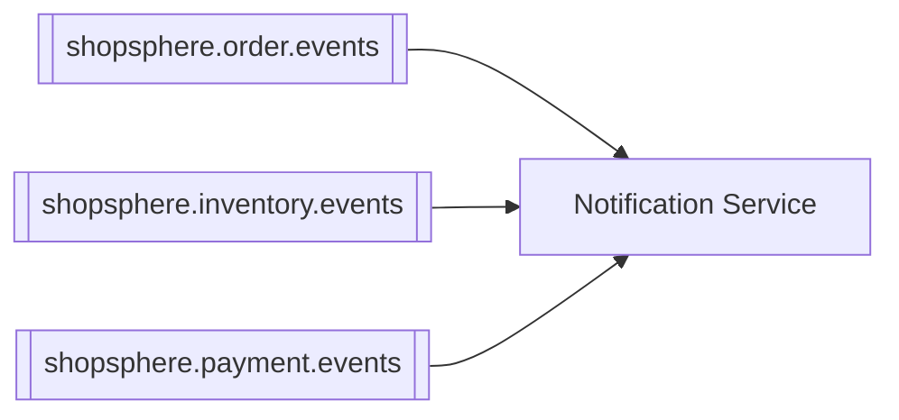

# Notification Service

Simulates order/payment notifications. No real email, SMS, or push
integration exists — sending is logged and recorded as if it happened, per
the project's current stage.

⬅ [Back to root README](../README.md)

---

## Service Overview

**Responsible for:** creating notification records and "sending" them
(simulated), keyed to meaningful business events.

**Role in the architecture:** Notification Service is a pure Kafka consumer
— it listens to all three topics in the system and reacts to the events
customers would actually care about (an order was created, a payment
succeeded or failed, inventory reservation failed). It publishes nothing of
its own.

---

## Architecture

```
Kafka Listeners (one class per topic)
      OrderEventNotificationConsumer      ─┐
      InventoryEventNotificationConsumer   ├─► Service (NotificationService)
      PaymentEventNotificationConsumer    ─┘         │
                                                       ▼
                                                Repository (Spring Data JPA)
                                                       │
                                                       ▼
                                                MySQL (shopsphere_notification)

Controller (NotificationController) ──► same Service layer, for direct/manual use
```

Each Kafka listener is a separate, focused class (not one giant listener)
that deserializes its event and calls the same `NotificationService`
methods a REST caller would use — `createNotification()` then
`sendNotification()`, both already backed by a sender abstraction that only
simulates delivery.

---

## Database

- **Technology:** MySQL 8, schema managed by **Flyway**, applied automatically on startup.
- **Database name:** `shopsphere_notification`

| Table | Purpose | Key columns |
|---|---|---|
| `notifications` | One row per notification | `user_id`, `type`, `channel` (`EMAIL`/`SMS`/`PUSH`), `recipient`, `subject`, `message`, `status` (`PENDING`/`SENT`/`FAILED`/`CANCELLED`), `sent_at`, `failure_reason` |

---

## APIs

- **Base URL:** `http://localhost:4007`
- **Swagger UI:** http://localhost:4007/swagger-ui.html
- **Health check:** http://localhost:4007/actuator/health
- **Authentication:** none.

| Method | Path | Purpose |
|---|---|---|
| POST | `/api/notifications` | Create a notification (also happens automatically via the Kafka consumers below) |
| GET | `/api/notifications/{notificationId}` | Get one notification |
| GET | `/api/notifications/user/{userId}` | Paginated list for a user |
| POST | `/api/notifications/{notificationId}/send` | Send (simulate) a pending notification |
| POST | `/api/notifications/{notificationId}/cancel` | Cancel a pending notification |

---

## Kafka

Notification Service **only consumes** — it publishes no events of its own.
All three listeners share one consumer group.

**Consumer group:** `shopsphere-notification-service`

| Topic | Event | Action |
|---|---|---|
| `shopsphere.order.events` | `OrderCreated` | Creates + simulates sending an `ORDER_CREATED` / `EMAIL` notification |
| `shopsphere.inventory.events` | `InventoryReservationFailed` | Logs only (see note below) — `InventoryReserved` is ignored |
| `shopsphere.payment.events` | `PaymentSucceeded` | Creates + simulates sending a `PAYMENT_SUCCESS` notification |
| `shopsphere.payment.events` | `PaymentFailed` | Creates + simulates sending a `PAYMENT_FAILED` notification |



**Why `InventoryReservationFailed` is log-only, not persisted:** the
`NotificationType` enum (`ORDER_CREATED`, `ORDER_CONFIRMED`,
`ORDER_CANCELLED`, `PAYMENT_SUCCESS`, `PAYMENT_FAILED`, `ORDER_SHIPPED`,
`ORDER_DELIVERED`) has no value that accurately represents an
inventory-specific failure — this is logged with full structured detail
(`eventId`, `orderId`, `orderNumber`, `reason`, `correlationId`) rather than
forcing a mismatched type onto it.

**Why the recipient is synthetic:** this service doesn't have a user's real
email/phone (that's User Service's data) and calling User Service just to
resolve one is intentionally avoided. A clearly-labeled placeholder
(`user-{userId}@shopsphere.local`) is used instead.

---

## Communication With Other Services

| Direction | Service | Mechanism | What flows |
|---|---|---|---|
| Inbound | Order Service | Kafka (`shopsphere.order.events`) | `OrderCreated` |
| Inbound | Inventory Service | Kafka (`shopsphere.inventory.events`) | `InventoryReservationFailed` |
| Inbound | Payment Service | Kafka (`shopsphere.payment.events`) | `PaymentSucceeded`, `PaymentFailed` |
| Outbound | — | — | Notification Service makes no calls to any other service |

---

## Configuration

| Property | Default | Notes |
|---|---|---|
| `server.port` | `4007` | |
| `spring.datasource.url` | `jdbc:mysql://localhost:3306/shopsphere_notification?...` | `mysql:3306` when run via Docker Compose |
| `spring.datasource.password` | *(local dev placeholder)* | See `.env.example` at the project root |
| `spring.kafka.bootstrap-servers` | `localhost:9092` | Overridable via `KAFKA_BOOTSTRAP_SERVERS`; `kafka:29092` via Docker Compose |
| `spring.kafka.consumer.group-id` | `shopsphere-notification-service` | Shared by all three listeners |

---

## Running the Service

Standalone (needs MySQL and Kafka reachable):
```bash
cd notification-service
mvn spring-boot:run
```

Or as part of the full stack:
```bash
docker compose up -d --build notification-service
```

Run its tests:
```bash
mvn clean test
```
