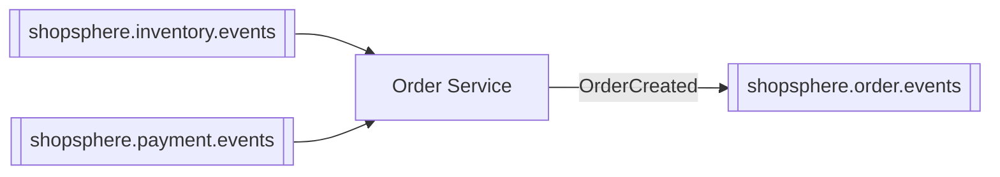

# Order Service

Creates orders and orchestrates checkout. This is the service most people
start reading the codebase from, because it touches every communication
pattern in the system: it's a REST client, a Kafka producer, and a Kafka
consumer, all at once.

⬅ [Back to root README](../README.md)

---

## Service Overview

**Responsible for:** creating orders, validating their items against the
real product catalog, tracking order status through checkout and
fulfillment, and cancellation.

**Role in the architecture:** Order Service is where checkout starts. It
makes exactly one synchronous call (to Product Service, for authoritative
pricing) and then hands the rest of the workflow to Kafka — it publishes
`OrderCreated` and returns to the client immediately, with the order still
`PENDING`. It never calls Inventory Service or Payment Service directly;
instead it listens for their outcome events and updates order status in
response. See the root README's sequence diagram for the full picture.

---

## Architecture

```
Controller (OrderController)
      │
      ▼
Service (OrderService / OrderServiceImpl)
      │
      ├──► REST Client (ProductServiceClient) ──► Product Service
      │
      ├──► Repository (Spring Data JPA) ──► MySQL (shopsphere_order)
      │
      └──► Event Producer (OrderEventProducer) ──► Kafka

Kafka Listeners (separate classes, not folded into OrderServiceImpl):
      InventoryEventConsumer  ──► OrderService.updateOrderStatus(...)
      PaymentEventConsumer    ──► OrderService.updateOrderStatus(...)
```

`createOrder()` does three things and nothing else: validate items via
`ProductServiceClient`, persist the order as `PENDING`, publish
`OrderCreated`. The two Kafka listeners are separate, focused classes (not
one giant listener) that each deserialize their event and call the same
`updateOrderStatus()` method a REST `PATCH` call would use.

`RestClient`-based HTTP clients for Inventory, Payment, and Cart Service
still exist in the codebase (`client/` package) and their REST endpoints
are still reachable — they're just no longer called from the checkout path.

---

## Database

- **Technology:** MySQL 8, schema managed by **Flyway** (two migrations:
  the original schema, plus one adding `payment_method`), applied
  automatically on startup.
- **Database name:** `shopsphere_order`

| Table | Purpose | Key columns |
|---|---|---|
| `orders` | One row per order | `order_number`, `user_id`, `status`, `currency`, `payment_method`, `subtotal`/`shipping_amount`/`tax_amount`/`discount_amount`/`total_amount`, `shipping_*` columns |
| `order_items` | Line items, snapshotted at order time | `order_id` (FK), `product_id`, `product_sku`, `product_name`, `quantity`, `unit_price`, `total_price` |

`order_items` stores a **snapshot** of SKU/name/price at the time of
purchase — it does not reference Product Service's current data, so a later
price change never affects a past order.

---

## APIs

- **Base URL:** `http://localhost:4004`
- **Swagger UI:** http://localhost:4004/swagger-ui.html
- **Health check:** http://localhost:4004/actuator/health
- **Authentication:** none.

| Method | Path | Purpose |
|---|---|---|
| POST | `/api/orders` | Start checkout — returns `201` with the order `PENDING`; does not wait for inventory/payment |
| GET | `/api/orders/{orderId}` | Get one order — **poll this to observe status progress** |
| GET | `/api/orders/number/{orderNumber}` | Get one order by its human-readable number |
| GET | `/api/orders/user/{userId}` | Paginated list of a user's orders |
| PATCH | `/api/orders/{orderId}/status` | Manually set status (fulfillment side, e.g. → `SHIPPED`) |
| POST | `/api/orders/{orderId}/cancel` | Cancel an order |

There is no global "list all orders" endpoint — orders are always scoped to
a user.

---

## Kafka

**Produces to:** `shopsphere.order.events`

| Event | Published when |
|---|---|
| `OrderCreated` | Immediately after an order is persisted as `PENDING` (never for a failed/rejected checkout) |

**Consumes from:** `shopsphere.inventory.events` and `shopsphere.payment.events`, consumer group `shopsphere-order-service`

| Event | Topic | Resulting status |
|---|---|---|
| `InventoryReserved` | `shopsphere.inventory.events` | `PENDING` → `PAYMENT_PENDING` |
| `InventoryReservationFailed` | `shopsphere.inventory.events` | → `FAILED` |
| `PaymentSucceeded` | `shopsphere.payment.events` | `PAYMENT_PENDING` → `PAID` |
| `PaymentFailed` | `shopsphere.payment.events` | → `FAILED` |



Every published event is keyed by `orderId` and carries a metadata envelope
(`eventId`, `eventType`, `eventVersion`, `occurredAt`, `correlationId`) plus
its domain fields — see the root README's "Event shape" section.

**Dual-write note:** persisting the order and publishing `OrderCreated` are
two separate steps, not one atomic transaction — see the root README's
Known Limitations for what that means in practice.

---

## Communication With Other Services

| Direction | Service | Mechanism | What flows |
|---|---|---|---|
| Outbound | Product Service | REST (`GET /api/products/{id}`) | Resolve authoritative price/SKU/name/status for every order item |
| Outbound | Kafka | Publish `OrderCreated` | Announce a new order to whoever's listening |
| Inbound | Inventory Service | Kafka (`shopsphere.inventory.events`) | Learn whether stock was reserved |
| Inbound | Payment Service | Kafka (`shopsphere.payment.events`) | Learn whether payment succeeded |

Order Service never calls Inventory Service, Payment Service, or Cart
Service over REST as part of checkout, even though those REST clients still
exist in the codebase for other uses.

---

## Configuration

| Property | Default | Notes |
|---|---|---|
| `server.port` | `4004` | |
| `spring.datasource.url` | `jdbc:mysql://localhost:3306/shopsphere_order?...` | `mysql:3306` when run via Docker Compose |
| `spring.datasource.password` | *(local dev placeholder)* | See `.env.example` at the project root |
| `shopsphere.services.product.url` | `http://localhost:4002` | Hardcoded for local dev; `http://product-service:4002` via Docker Compose |
| `shopsphere.services.inventory.url` | `http://localhost:4005` | Client still exists; not called during checkout |
| `shopsphere.services.payment.url` | `http://localhost:4006` | Client still exists; not called during checkout |
| `shopsphere.services.cart.url` | `http://localhost:4003` | Client still exists; not called during checkout |
| `shopsphere.http.connect-timeout-ms` / `read-timeout-ms` | `2000` / `3000` | Applies to the Product Service REST call |
| `spring.kafka.bootstrap-servers` | `localhost:9092` | Overridable via `KAFKA_BOOTSTRAP_SERVERS`; `kafka:29092` via Docker Compose |
| `spring.kafka.consumer.group-id` | `shopsphere-order-service` | Shared by both listeners in this service |

---

## Running the Service

Standalone (needs MySQL, Kafka, and Product Service reachable):
```bash
cd order-service
mvn spring-boot:run
```

Or as part of the full stack:
```bash
docker compose up -d --build order-service
```

Run its tests:
```bash
mvn clean test
```
