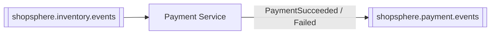

# Payment Service

Processes and records payments. Triggered by successful inventory
reservation — Order Service never calls this service directly during
checkout.

⬅ [Back to root README](../README.md)

---

## Service Overview

**Responsible for:** creating payment records and processing them (with a
built-in simulation mode, since there's no real payment gateway involved),
plus refunds and cancellations.

**Role in the architecture:** Payment Service only attempts a payment once
it knows stock has actually been reserved for the order — that's why it
consumes `InventoryReserved` rather than `OrderCreated` directly. It
publishes the outcome (`PaymentSucceeded`/`PaymentFailed`) for Order
Service, Cart Service, and Notification Service to react to independently.

---

## Architecture

```
Controller (PaymentController)          Kafka Listener (PaymentEventConsumer)
      │                                          │
      ▼                                          ▼
Service (PaymentService / PaymentServiceImpl) ◄──┘  (same service layer either way)
      │
      ▼
Repository (Spring Data JPA)
      │
      ▼
MySQL (shopsphere_payment)
      │
      ▼ (on outcome)
Event Producer (PaymentEventProducer) ──► Kafka
```

The Kafka listener calls `PaymentService.createPayment()` then
`processPayment()` directly — the same two calls the REST endpoints expose,
never a self-call over HTTP.

---

## Database

- **Technology:** MySQL 8, schema managed by **Flyway**, applied automatically on startup.
- **Database name:** `shopsphere_payment`

| Table | Purpose | Key columns |
|---|---|---|
| `payments` | One row per payment attempt | `payment_reference` (unique), `order_id`, `user_id`, `amount`, `currency`, `status` (`PENDING`/`PROCESSING`/`SUCCESS`/`FAILED`/`REFUNDED`/`CANCELLED`), `payment_method`, `failure_reason` |

---

## APIs

- **Base URL:** `http://localhost:4006`
- **Swagger UI:** http://localhost:4006/swagger-ui.html
- **Health check:** http://localhost:4006/actuator/health
- **Authentication:** none.

| Method | Path | Purpose |
|---|---|---|
| POST | `/api/payments` | Create a payment intent (`PENDING`) |
| GET | `/api/payments/{paymentId}` | Get a payment |
| GET | `/api/payments/reference/{paymentReference}` | Get a payment by its reference string |
| GET | `/api/payments/order/{orderId}` | List payments for an order |
| POST | `/api/payments/{paymentId}/process` | Process a payment; accepts a `simulationMode` (`SUCCESS`/`FAILURE`/`TIMEOUT`) for testing |
| POST | `/api/payments/{paymentId}/refund` | Refund a successful payment |
| POST | `/api/payments/{paymentId}/cancel` | Cancel a pending payment |

**Important:** `/process` always returns HTTP `200` — the actual outcome is
in the response body's `status` field, not the HTTP status code.

There is no "list all payments" endpoint — always look up by ID, reference,
or order ID.

---

## Kafka

**Consumes from:** `shopsphere.inventory.events`, consumer group `shopsphere-payment-service`

| Event | Action |
|---|---|
| `InventoryReserved` | Creates and processes a payment for the order |
| `InventoryReservationFailed` | Ignored — nothing to pay for if inventory already failed |

**Produces to:** `shopsphere.payment.events`

| Event | Published when |
|---|---|
| `PaymentSucceeded` | Payment processed successfully |
| `PaymentFailed` | Payment declined or failed |



Neither event carries card numbers, CVVs, or any other sensitive payment
detail — only `orderId`, `orderNumber`, `userId`, `paymentId`, and
amount/currency (success) or a `reason` string (failure).

**Duplicate-delivery guard:** before processing an `InventoryReserved`
message, the consumer checks whether a payment already exists for that
`orderId` and skips if so — a narrow safeguard against double-charging on
redelivery (not a general idempotency framework; see the root README).

---

## Communication With Other Services

| Direction | Service | Mechanism | What flows |
|---|---|---|---|
| Inbound | Inventory Service | Kafka (`shopsphere.inventory.events`) | `InventoryReserved` triggers payment processing |
| Outbound | Kafka | Publish `PaymentSucceeded` / `PaymentFailed` | Consumed by Order Service, Cart Service, and Notification Service |

Payment Service makes no REST calls to any other service.

---

## Configuration

| Property | Default | Notes |
|---|---|---|
| `server.port` | `4006` | |
| `spring.datasource.url` | `jdbc:mysql://localhost:3306/shopsphere_payment?...` | `mysql:3306` when run via Docker Compose |
| `spring.datasource.password` | *(local dev placeholder)* | See `.env.example` at the project root |
| `spring.kafka.bootstrap-servers` | `localhost:9092` | Overridable via `KAFKA_BOOTSTRAP_SERVERS`; `kafka:29092` via Docker Compose |
| `spring.kafka.consumer.group-id` | `shopsphere-payment-service` | |

---

## Running the Service

Standalone (needs MySQL and Kafka reachable):
```bash
cd payment-service
mvn spring-boot:run
```

Or as part of the full stack:
```bash
docker compose up -d --build payment-service
```

Run its tests:
```bash
mvn clean test
```
